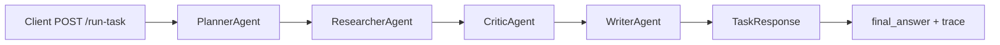

# Multi-Agent FastAPI Demo

A small FastAPI app that runs a task through four Python agents in sequence, each powered by **Mistral via OpenRouter**. Each agent receives a structured dict, enriches it with LLM-generated content, and passes it to the next. The API returns the final answer plus a full trace of every step.

## How it works

The app is a **linear pipeline**: one HTTP request runs four agents in order. Each agent calls Mistral to do real work — planning, researching, reviewing, and writing.



### Flow

1. Client sends `{ "task": "..." }` to `POST /run-task`.
2. **PlannerAgent** uses Mistral to break the task into 3 actionable steps.
3. **ResearcherAgent** uses Mistral to add 2 research notes per step.
4. **CriticAgent** uses Mistral to review the plan and research, adding review notes.
5. **WriterAgent** uses Mistral to assemble everything into a markdown `final_answer`.
6. The API returns `final_answer` plus a `trace` of every agent step.

`GET /health` returns `{"status": "ok"}` for a simple liveness check.

### Agent pipeline

| Agent | Input | Adds to the dict |
|-------|-------|------------------|
| **PlannerAgent** | `{ "task": "..." }` | `"steps": ["...", "..."]` |
| **ResearcherAgent** | planner output | `"research": { step: [details...] }` |
| **CriticAgent** | researcher output | `"critic_notes": ["...", ...]` |
| **WriterAgent** | critic output | `"final_answer": "..."` (markdown) |

The orchestrator lives in `src/main.py`. Agent classes are in `src/agents.py`. Request/response models are in `src/models.py`.

### Data evolution (example)

**After Planner:**

```json
{
  "task": "Explain how to set up a simple FastAPI project",
  "steps": [
    "Install FastAPI and uvicorn using pip",
    "Create a main.py file and define your first route",
    "Run the development server and test via /docs"
  ]
}
```

Each later agent keeps prior fields and adds its own (`research`, then `critic_notes`, then `final_answer`). The `trace` in the response records each agent's `input` and `output` for debugging and auditing.

## Project structure

```
agent-to-agent-communication/
├── src/
│   ├── main.py        # FastAPI app and pipeline orchestration
│   ├── agents.py      # PlannerAgent, ResearcherAgent, CriticAgent, WriterAgent
│   └── models.py      # Pydantic models: TaskRequest, AgentStep, TaskResponse
├── tests/
│   └── test_agents.py # 28 tests covering endpoints and unit logic
├── .github/
│   └── workflows/     # CI/CD via GitHub Actions
├── .env.example
├── requirements.txt
├── pytest.ini
└── README.md
```

## Install

```bash
pip install -r requirements.txt
```

## Environment setup

Copy `.env.example` to `.env` and fill in your OpenRouter API key:

```bash
cp .env.example .env
```

`.env.example`:
```
OPENROUTER_API_KEY=your_openrouter_api_key_here
OPENROUTER_URL=https://openrouter.ai/api/v1/chat/completions
GPT_MODEL=mistralai/mistral-small-3.2-24b-instruct
```

Get a free API key at [openrouter.ai](https://openrouter.ai).

## Run dev server

From the project root:

```bash
uvicorn src.main:app --reload
```

The API is available at `http://127.0.0.1:8000`. Interactive docs: `http://127.0.0.1:8000/docs`.

## Example request

```bash
curl -X POST http://127.0.0.1:8000/run-task \
  -H "Content-Type: application/json" \
  -d "{\"task\": \"Explain how to set up a simple FastAPI project\"}"
```

Request body:

```json
{
  "task": "Explain how to set up a simple FastAPI project"
}
```

Response shape:

```json
{
  "final_answer": "## Setting Up a Simple FastAPI Project\n\nTo get started with FastAPI...",
  "trace": [
    {
      "agent_name": "PlannerAgent",
      "input": { "task": "Explain how to set up a simple FastAPI project" },
      "output": { "task": "...", "steps": ["...", "...", "..."] }
    },
    {
      "agent_name": "ResearcherAgent",
      "input": { "task": "...", "steps": ["..."] },
      "output": { "task": "...", "steps": ["..."], "research": { "...": ["..."] } }
    },
    {
      "agent_name": "CriticAgent",
      "input": { "...": "..." },
      "output": { "...": "...", "critic_notes": ["..."] }
    },
    {
      "agent_name": "WriterAgent",
      "input": { "...": "..." },
      "output": { "...": "...", "final_answer": "..." }
    }
  ]
}
```

## Run tests

```bash
pytest -v
```

### Test coverage — 28 tests

**Endpoint tests: `POST /run-task`**

| # | Test | What it checks |
|---|------|----------------|
| 1 | `test_run_task_returns_final_answer_and_full_trace` | Full happy path — status 200, all 4 agents in trace |
| 2 | `test_run_task_rejects_empty_task` | Empty string → 422 validation error |
| 3 | `test_run_task_rejects_missing_task_field` | Missing field entirely → 422 |
| 4 | `test_run_task_rejects_non_string_task` | Integer instead of string → 422 |
| 5 | `test_run_task_trace_has_correct_agent_order` | Agents fire in Planner→Researcher→Critic→Writer order |
| 6 | `test_run_task_final_answer_contains_task` | Original task text echoed in final answer |
| 7 | `test_run_task_with_short_task` | ≤4 word task takes short-task branch in Planner |
| 8 | `test_run_task_with_long_task` | >4 word task takes long-task branch, produces 3 steps |
| 9 | `test_run_task_final_answer_contains_plan_section` | `## Plan` section present in output |
| 10 | `test_run_task_final_answer_contains_research_section` | `## Research` section present |
| 11 | `test_run_task_final_answer_contains_review_section` | `## Review` section present |
| 12 | `test_run_task_final_answer_contains_summary_section` | `## Summary` section present |
| 13 | `test_run_task_planner_output_has_steps_key` | Planner trace output contains `steps` list |
| 14 | `test_run_task_researcher_output_has_research_key` | Researcher trace output contains `research` dict |
| 15 | `test_run_task_critic_output_has_notes_key` | Critic trace output contains `critic_notes` list |
| 16 | `test_run_task_writer_output_has_final_answer_key` | Writer trace output contains `final_answer` |

**Endpoint tests: `GET /health`**

| # | Test | What it checks |
|---|------|----------------|
| 17 | `test_health_endpoint` | Returns `{"status": "ok"}` with status 200 |
| 18 | `test_health_endpoint_method_not_allowed` | POST on `/health` → 405 |

**Unit tests: individual agents**

| # | Test | What it checks |
|---|------|----------------|
| 19 | `test_planner_short_task_produces_three_steps` | ≤4 word input → 3 steps |
| 20 | `test_planner_long_task_produces_three_steps` | >4 word input → 3 steps |
| 21 | `test_planner_output_contains_task_key` | Planner preserves original `task` key |
| 22 | `test_researcher_adds_two_details_per_step` | Exactly 2 detail strings per step |
| 23 | `test_researcher_preserves_existing_keys` | Researcher keeps `task` and `steps` from prior output |
| 24 | `test_critic_adds_note_for_very_short_task` | Task < 10 chars triggers short-task warning note |
| 25 | `test_critic_flags_missing_research_coverage` | Steps with no research → gap note added |
| 26 | `test_critic_clean_run_produces_proceed_note` | Complete plan + research → "proceed" note |
| 27 | `test_writer_final_answer_is_string` | Final answer is a non-empty string |
| 28 | `test_writer_final_answer_starts_with_response_header` | Output starts with `# Response to: {task}` |

## Status

### What is complete
- Four-agent linear pipeline (Planner → Researcher → Critic → Writer)
- Each agent powered by Mistral (`mistral-small-3.2-24b-instruct`) via OpenRouter
- FastAPI with typed Pydantic request/response models
- Full trace returned per request for debugging and auditing
- 28 tests covering endpoints, agent order, output keys, branching logic, and edge cases
- CI/CD via GitHub Actions
- `/health` liveness endpoint

### What is pending
- Demo video (3–5 min walkthrough of setup, run, and output)

### What can be improved
- Add async execution so independent agents can run in parallel
- Add memory so agents can reference context from previous tasks
- Add streaming responses so the client sees output as each agent finishes
- Add authentication to the `/run-task` endpoint for production use
- Mock LLM calls in tests so they run offline and don't hit the API