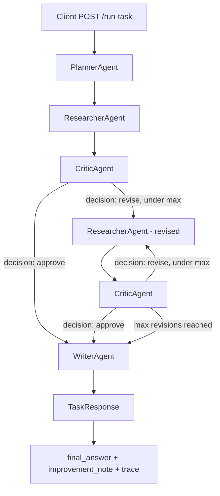

# Multi-Agent FastAPI Demo

A small FastAPI app that runs a task through four Python agents, each powered by **Mistral via OpenRouter**. Each agent receives a structured dict, enriches it with LLM-generated content, and passes it to the next. Unlike a fixed linear pipeline, the **Critic makes a real approve/revise decision** that controls whether the Researcher runs again — the flow branches based on the model's own judgment, not hardcoded rules. The API returns the final answer, an improvement note, and a full trace of every step.

## How it works

One HTTP request runs Planner → Researcher → Critic, then loops back to Researcher if the Critic says "revise" (up to a capped number of times), before finally reaching the Writer. Every agent calls Mistral to do real work — nothing about *what* each agent produces is scripted; only the *routing* between Researcher/Critic is orchestrated in code.



### Flow

1. Client sends `{ "task": "..." }` to `POST /run-task`. FastAPI/Pydantic reject invalid input (empty string, missing field, non-string) with a 422 before any agent runs.
2. **PlannerAgent** calls Mistral to break the task into exactly 3 actionable steps.
3. **ResearcherAgent** calls Mistral once per step, adding 2 research notes per step.
4. **CriticAgent** calls Mistral and requires its reply to start with a literal `APPROVE` or `REVISE`, followed by 1-2 short review notes. This decision — not any Python logic — controls what happens next.
5. **Decision point:**
   - If `APPROVE` → go straight to Writer.
   - If `REVISE` → **ResearcherAgent runs again**, this time also given the Critic's specific feedback, producing new research that addresses it. CriticAgent then reviews again. This can repeat up to `MAX_REVISIONS` times (currently 2) before forcing a move to Writer regardless, so the loop can never run forever.
6. **WriterAgent** calls Mistral twice: once to write the final markdown `final_answer`, and once to produce a short `improvement_note` explaining how the final answer reflects the Critic's feedback.
7. The API returns `final_answer`, `improvement_note`, and a full `trace` of every step — including every revision pass, if any occurred.

`GET /health` returns `{"status": "ok"}` for a simple liveness check.

### Agent pipeline

| Agent | Input | Adds to the dict |
|-------|-------|------------------|
| **PlannerAgent** | `{ "task": "..." }` | `"steps": ["...", "..."]` |
| **ResearcherAgent** | planner output | `"research": { step: [details...] }` |
| **CriticAgent** | researcher output | `"critic_notes": ["...", ...]` |
| **WriterAgent** | critic output | `"final_answer": "..."` (markdown) |

The orchestrator (including the revision loop) lives in `src/main.py`. Agent classes are in `src/agents.py`. Request/response models are in `src/models.py`.

### State vs. memory

Each agent is **stateless** on its own — every call to Mistral is a fresh system+user exchange with no private conversation history. What drives the revision loop is **orchestration state** in `main.py`: a revision counter and a dict that keeps growing, explicitly passed to each agent. This is a deliberate choice: every piece of context any agent used is visible in the `data` dict and the `trace`, rather than hidden inside an agent's internal memory — which keeps the whole run auditable end-to-end.

### Data evolution (example — no revision needed)

**After Planner:**

```json
{
  "task": "Explain how to set up a simple FastAPI project",
  "steps": [
    "Install FastAPI and uvicorn using pip",
    "Create a main.py file and define your first route",
    "Run the development server and test via /docs"
  ]
}
```

Each later agent keeps prior fields and adds its own (`research`, then `critic_decision`/`critic_notes`, then `final_answer`/`improvement_note`). The `trace` in the response records each agent's `input` and `output` for debugging and auditing — including a `"ResearcherAgent (revised)"` entry for every extra pass triggered by a `revise` decision.

## Project structure

```
agent-to-agent-communication/
├── src/
│   ├── main.py        # FastAPI app, pipeline orchestration, and the revision loop
│   ├── agents.py      # PlannerAgent, ResearcherAgent, CriticAgent, WriterAgent
│   └── models.py      # Pydantic models: TaskRequest, AgentStep, TaskResponse
├── tests/
│   └── test_agents.py # tests covering endpoints and unit logic
├── .github/
│   └── workflows/     # CI/CD via GitHub Actions
├── .env.example
├── requirements.txt
├── pytest.ini
└── README.md
```

## Install

```bash
pip install -r requirements.txt
```

## Environment setup

Copy `.env.example` to `.env` and fill in your OpenRouter API key:

```bash
cp .env.example .env
```

`.env.example`:
```
OPENROUTER_API_KEY=your_openrouter_api_key_here
OPENROUTER_URL=https://openrouter.ai/api/v1/chat/completions
GPT_MODEL=mistralai/mistral-small-3.2-24b-instruct
```

Get a free API key at [openrouter.ai](https://openrouter.ai).

## Run dev server

From the project root:

```bash
uvicorn src.main:app --reload
```

The API is available at `http://127.0.0.1:8000`. Interactive docs: `http://127.0.0.1:8000/docs`.

## Example request

```bash
curl -X POST http://127.0.0.1:8000/run-task \
  -H "Content-Type: application/json" \
  -d "{\"task\": \"Explain how to set up a simple FastAPI project\"}"
```

Request body:

```json
{
  "task": "Explain how to set up a simple FastAPI project"
}
```

Response shape (example where the Critic approved on the first pass — no revision needed):

```json
{
  "final_answer": "## Setting Up a Simple FastAPI Project\n\nTo get started with FastAPI...",
  "improvement_note": "The final answer incorporates the critic's note about including error handling by adding a short troubleshooting section.",
  "trace": [
    {
      "agent_name": "PlannerAgent",
      "input": { "task": "Explain how to set up a simple FastAPI project" },
      "output": { "task": "...", "steps": ["...", "...", "..."] }
    },
    {
      "agent_name": "ResearcherAgent",
      "input": { "task": "...", "steps": ["..."] },
      "output": { "task": "...", "steps": ["..."], "research": { "...": ["..."] } }
    },
    {
      "agent_name": "CriticAgent",
      "input": { "...": "..." },
      "output": { "...": "...", "critic_decision": "approve", "critic_notes": ["..."] }
    },
    {
      "agent_name": "WriterAgent",
      "input": { "...": "..." },
      "output": { "...": "...", "final_answer": "...", "improvement_note": "..." }
    }
  ]
}
```

If the Critic instead returns `"critic_decision": "revise"`, the trace will contain extra `"ResearcherAgent (revised)"` and `"CriticAgent"` entries before the final `"WriterAgent"` entry — the trace length is not fixed at 4, since it reflects however many passes the Critic's own judgment required (capped at `MAX_REVISIONS`).

## Run tests

```bash
pytest -v
```

> **Note:** some existing tests assert exact trace length (`== 4`) or specific literal wording in agent output (e.g. `"gap"`, `"proceed"`, `"## Plan"`). These were written against earlier, more deterministic agent behavior. Now that the Critic makes a real approve/revise decision and the Researcher/Critic can loop, trace length varies and exact wording is no longer guaranteed — these tests may need to be rewritten to check structure (e.g. "trace contains all required agent roles in order," "critic_decision is one of approve/revise") rather than exact strings or counts.

## Status

### What is complete
- Planner → Researcher → Critic loop → Writer pipeline, with the Critic's own `approve`/`revise` decision controlling whether Researcher runs again
- Each agent powered by Mistral (`mistral-small-3.2-24b-instruct`) via OpenRouter
- FastAPI with typed Pydantic request/response models
- Full trace returned per request, including every revision pass, for debugging and auditing
- Capped revision loop (`MAX_REVISIONS`) so the pipeline can't run forever
- `improvement_note` explicitly explaining how the final answer changed after review
- CI/CD via GitHub Actions
- `/health` liveness endpoint

### What is pending
- Demo video (3–5 min walkthrough of setup, run, and output)

### What can be improved
- Add async execution so independent research steps can run in parallel
- Add per-agent memory so an agent could reference its own past reasoning directly, instead of relying on the orchestrator to pass context forward
- Add streaming responses so the client sees output as each agent finishes
- Add authentication to the `/run-task` endpoint for production use
- Mock LLM calls in tests so they run offline and don't hit the API
